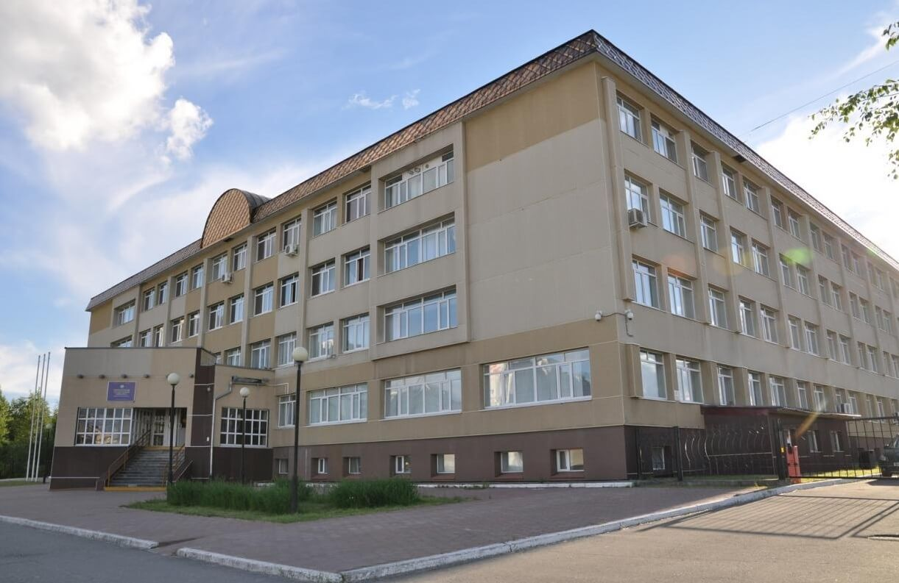

# kseniasibation.github.io

<!DOCTYPE html>
<html lang="ru">

<head>
    <meta charset="utf-8">
    <title>Сайт студента</title>
    <link rel="stylesheet" href="STYLE.css">
    

</head>

<body bgcolor="#c0c0c0">
    <h1> Сайт принадлежит студенту НВГУ</h1>

    <table width="100%">
        <tbody>
            <tr>
                <td class="right">
                    <h3 class="firststyle">Фото студента</h3>
                </td>
                <td>
                    <h3 class="firststyle"> Вот университет в котором я прохожу обучение </h3>
                </td>
            </tr>
            <tr>
                <td class="right"> </td>
                <td>
                    
                </td>
            </tr>
        </tbody>
    </table>

    <h2 class="firststyle"> По всем вопросам пишите по адресу ksenia@donttextme.com </h2>
    <h4 class="firststyle"> Немного информации о моем университете </h4>
    

        <b>НВГУ</b> – это динамично развивающееся учебное заведение высшего профессионального образования, ведущий вуз Югры по целому ряду образовательных направлений университетской подготовки высококвалифицированных кадров для науки, образования, экономики и культуры.
    

    <h5 class="firststyle"> Группа в которой я обучаюсь: Прикладная математика и информатика</h5>

    
<b>Прикладная математика и информатика</b> – специальность, позволяющая составлять компьютерные программы и языки программирования, а также работать с ними. Обучение ведется по трем направлениям: предметы математического цикла: алгебра, геометрия, математический анализ, дискретная математика и др, программирование: компьютерная графика, языки программирования и пр., работа с базами данных и системный анализ

    
Выпускники программы могут строить карьеру в разных направлениях. Поле деятельности огромно: искусственный интеллект и системное программирование, разработка программного обеспечения и компьютерных игр, анализ данных, компьютерная лингвистика, интернет-программирование, разработка рекомендательных систем — и это далеко не полный список.

    <h4 class="firststyle"><b>Увлечения и хобби </b></h4>
    <ul>
        <li>Дегустация еды</li>
        <li>Изучение, просмотр видео </li>
        <li>Проходение игр</li>
    </ul>
    <h7 class="firststyle">Любая другая информация </h7>
    
 not found

</body>
